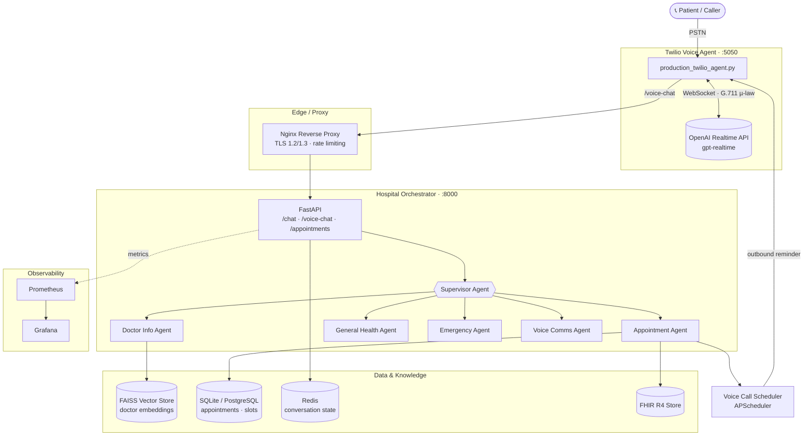
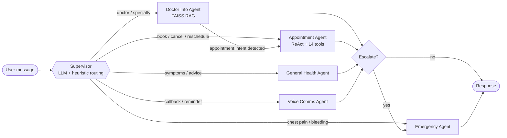
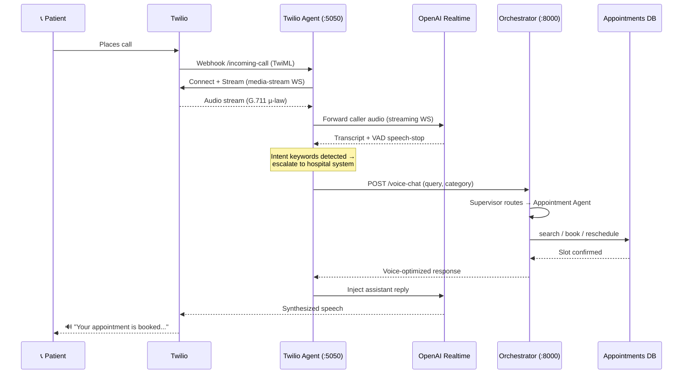
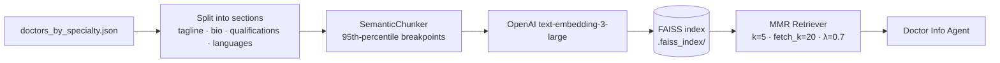

<div align="center">

# 🏥 Hospital AI TeleAssist

### A production-grade, multi-agent healthcare assistant with real-time voice, RAG-powered doctor search, appointment automation, and FHIR interoperability.

[](https://www.python.org/)
[](https://fastapi.tiangolo.com/)
[](https://langchain-ai.github.io/langgraph/)
[](https://platform.openai.com/)
[](https://www.twilio.com/)
[](https://github.com/facebookresearch/faiss)
[](https://hl7.org/fhir/)
[](https://www.docker.com/)
[](https://aws.amazon.com/ecs/)
[](https://prometheus.io/)

</div>

---

## 📋 Overview

**Hospital AI TeleAssist** is an end-to-end conversational healthcare platform. A patient can **call a phone number** and speak naturally with an AI assistant that understands medical intent in real time, finds the right doctor using semantic search, books or reschedules appointments against a live database, schedules reminder callbacks, and escalates medical emergencies — all while remaining grounded in a FHIR R4-compliant healthcare data model.

It is architected as a set of **containerized microservices** with a LangGraph multi-agent "brain," resilience patterns (circuit breakers, retries, timeouts), and a full production deployment story on AWS (ECS Fargate + Terraform) with Prometheus/Grafana observability.

---

## ✨ Key Features

| Capability | What it does |
|---|---|
| 🗣️ **Real-time voice** | Bidirectional phone calls via **Twilio Media Streams ↔ OpenAI Realtime API** (G.711 µ-law, server-side VAD), with a graceful TwiML fallback when Realtime is unavailable. |
| 🧠 **Multi-agent orchestration** | A LangGraph `StateGraph` with a **Supervisor** that routes to specialized agents: Doctor Info, Appointments, General Health, Voice, and Emergency — with conditional edges, agent hand-off, and multi-turn memory. |
| 🔎 **RAG doctor search** | FAISS vector store over doctor profiles, **semantic chunking** (95th-percentile breakpoints), `text-embedding-3-large`, and **MMR retrieval** for relevant + diverse results. |
| 📅 **Appointment automation** | A ReAct agent with 14 tools (search, availability, book / reschedule / cancel) over a normalized SQLite schema with **triggers** that keep slot booking consistent. |
| ⏰ **Smart reminders** | APScheduler-based reminder calls (24h before appointment) and ad-hoc callbacks, initiated as outbound Twilio calls. |
| 🚑 **Emergency detection** | Multi-stage keyword + heuristic detection that escalates acute cases while filtering non-acute false positives ("follow-up chest pain" ≠ emergency). |
| 🏥 **FHIR R4 interoperability** | Pydantic models for `Practitioner`, `PractitionerRole`, `Appointment`, `Slot`, `Schedule` with **SNOMED CT** specialty codes; dual-mode client (native FHIR server *or* local store). |
| 🛡️ **Production resilience** | Circuit breaker, exponential-backoff retries, bounded voice timeouts with intelligent fallback routing, health checks, and trace IDs for observability. |

---

## 🏗️ System Architecture



### Multi-Agent Routing (LangGraph)



### Real-Time Voice Call Flow



### RAG Ingestion Pipeline



---

## 🧰 Tech Stack

| Layer | Technologies |
|---|---|
| **Language** | Python 3.11+ |
| **AI / Agents** | LangGraph, LangChain, OpenAI GPT (reasoning) + Realtime API (voice), `text-embedding-3-large` |
| **Vector / RAG** | FAISS, LangChain SemanticChunker, MMR retrieval |
| **Web / API** | FastAPI, Uvicorn, Pydantic v2 |
| **Voice / Telephony** | Twilio Programmable Voice + Media Streams, WebSockets |
| **Scheduling** | APScheduler (date + cron triggers) |
| **Data** | SQLite (dev) / PostgreSQL (prod), Redis (state), FHIR R4 |
| **Infra** | Docker, Docker Compose, Nginx, AWS ECS Fargate, Terraform, ECR, RDS, ElastiCache |
| **Observability** | Prometheus, Grafana, custom metrics, health checks |

---

## 📂 Repository Structure

```
aiteleassist/
├── production_hospital_orchestrator.py   # FastAPI app: /chat, /voice-chat, /appointments
├── hospital_chatbot_orchestrator.py      # LangGraph multi-agent StateGraph + agents
├── faiss_rag_integration.py              # FAISS retriever wrapper (MMR, metadata)
├── ingest_doctors_Faiss.py               # RAG ingestion (semantic chunking → FAISS)
├── embedding.py                          # OpenAI embedding adapter
├── voice_tools.py / voice_call_scheduler.py  # Reminder/callback scheduling (APScheduler)
├── fhir_mapping.py                       # FHIR R4 models + client (SNOMED CT codes)
├── production_monitoring.py              # Prometheus metrics + health checks
├── config.py / chatbot_config.py         # Pydantic settings + routing patterns
│
├── Apointment_agent/                     # Appointment ReAct agent + DB tooling
│   ├── appointments_agent.py             #   14 tools: search / availability / book / cancel
│   ├── create_tables.py                  #   normalized schema + triggers
│   ├── seed_data.py                      #   demo patients, doctors, slots
│   └── doctors_by_specialty.json         #   doctor profiles (RAG + seed source)
│
├── twillio_comms_agent/twillio_call/     # Twilio + OpenAI Realtime voice agent
│   └── production_twilio_agent.py
│
├── orchestrator_service/                 # Lightweight orchestrator service container
│
├── Dockerfile.orchestrator / Dockerfile.twilio   # AWS/ECS build path (deploy.sh)
├── docker-compose.prod.yml               # Local full-stack deployment
├── aws-ecs-compose.yml / terraform/      # AWS ECS Fargate + IaC
├── nginx/ · monitoring/                  # Reverse proxy + Prometheus config
└── deploy.sh                             # Build → Terraform → ECS → health check
```

---

## 🚀 Getting Started (Local)

### 1. Prerequisites
- Python 3.11+
- An OpenAI API key (with **Realtime API** access for voice)
- A Twilio account + phone number (only needed for live voice calls)

### 2. Setup

```bash
git clone https://github.com/AI-techResearcher/hospital-ai-teleassist.git
cd hospital-ai-teleassist

python -m venv .venv
source .venv/bin/activate        # Windows: .venv\Scripts\activate

pip install -r requirements.txt

cp .env.example .env             # then fill in your keys
```

### 3. Build the data layer

The appointment database and FAISS index are **generated artifacts** (not committed). Build them once:

```bash
# Create the normalized SQLite schema AND seed demo data
# (patients, doctors from doctors_by_specialty.json, working hours, slots)
python Apointment_agent/create_tables.py

# Build the FAISS vector index from doctor profiles
python ingest_doctors_Faiss.py --input Apointment_agent/doctors_by_specialty.json --faiss-dir .faiss_index
```

### 4. Run the services

```bash
# Terminal 1 — Orchestrator (multi-agent brain)
uvicorn production_hospital_orchestrator:app --port 8000 --reload

# Terminal 2 — Twilio voice agent
cd twillio_comms_agent/twillio_call
uvicorn production_twilio_agent:app --port 5050 --reload
```

Try the text endpoint:

```bash
curl -X POST http://localhost:8000/chat \
  -H "Content-Type: application/json" \
  -d '{"message": "I need a cardiologist next Tuesday morning", "conversation_id": "demo-1"}'
```

For **live phone calls**, expose port 5050 with a tunnel (e.g. ngrok) and point your Twilio number's voice webhook at `https://<your-tunnel>/incoming-call`.

---

## 🐳 Run with Docker Compose

```bash
cp .env.example .env             # fill in keys
docker compose -f docker-compose.prod.yml up --build
```

This brings up the voice agent, orchestrator, Nginx reverse proxy, and supporting services.

---

## ☁️ Production Deployment (AWS)

The repo includes a complete IaC + container deployment story:

- **`terraform/main.tf`** — VPC, public/private subnets, ALB, ECS Fargate cluster, RDS PostgreSQL, ElastiCache Redis, ECR repositories, CloudWatch log groups, and Secrets Manager entries.
- **`aws-ecs-compose.yml`** — ECS task definitions (CPU/memory sizing, Secrets Manager refs).
- **`deploy.sh`** — orchestrates: prerequisite checks → build & push images to ECR → `terraform apply` → register ECS task definitions → health-check loop.

```bash
./deploy.sh        # requires AWS CLI, Docker, and Terraform configured
```

Secrets (OpenAI, Twilio, database URL) are pulled from **AWS Secrets Manager** at runtime — they are never baked into images.

---

## 📊 Observability

- **Prometheus** scrapes custom metrics: call counts/duration, request latency per endpoint, agent usage, OpenAI token usage, DB query duration, and per-service health.
- **Grafana** dashboards are provisioned for visualization.
- Each service exposes `/health` for container/ALB health checks; the orchestrator also exposes `/metrics`.

---

## 🔐 Security Notes

- No secrets are committed — all configuration is via environment variables (`.env.example` documents every variable).
- TLS 1.2/1.3 termination at Nginx; rate limiting on API and Twilio webhook zones.
- Non-root container users; ECR image scanning on push.
- PHI redaction and conversation-logging flags are configurable.

---

## 🗺️ Roadmap

- [ ] Replace SQLite with PostgreSQL as the default appointment store
- [ ] Add automated test coverage + CI (GitHub Actions)
- [ ] HIPAA-grade audit logging
- [ ] Multi-language voice support

---

<div align="center">

Built with FastAPI, LangGraph, OpenAI, and Twilio.

</div>
